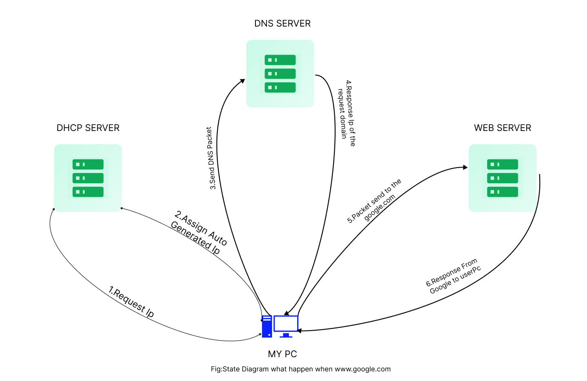
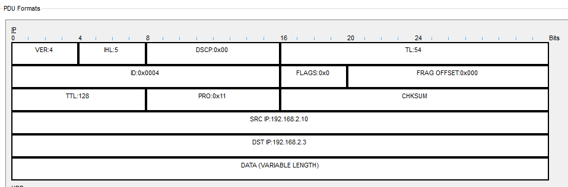

# www.google.com
# Notion file https://lush-idea-e7b.notion.site/www-google-com-6790edea686e47dbb6649275e18f89ac
- **DHCP (Dynamic Host Configuration Protocol):**
It is a network management protocol used to dynamically assign an IP address to any device, or node on a network so it can communicate using IP. DHCP automates and centrally manages these configurations rather than requiring network administrators to manually assign IP addresses to all network devices. DHCP can be implemented on small local networks, as well as large enterprise networks.
- **WEB SERVER**
    
    A web server is a computer system that stores, processes, and delivers web content such as web pages. It is a combination of software and the underlying hardware. The primary function of a web server is to host websites and provide a way for users to access the content on these websites through their web browsers. Web servers use HTTP (Hypertext Transfer Protocol) to communicate with clients and deliver requested content, such as HTML pages, images, and other resources.
    
- **DNS (Domain Name System):**
    
    The Domain Name System (DNS) is the phonebook of the Internet. When users type domain name  such as ‘google.com’  into web browsers, DNS is responsible for finding the correct IP addresses for those sites. Browsers then use those addresses to communicate with orgin server  to access website information.
    
    
    
    # Steps to describe how it works
    
    1. **Request ip / Assign Auto Generated Ip**
        1. The DHCP server receives the request from my pc and checks its pool of available IP addresses.
        2. If an IP address is available, the server reserves that address and sends an offer to the client.
        3. The client receives the offer and sends a request to accept the offered address.
        4. The DHCP server acknowledges the request and assigns the IP address to the client.
    2. **Send Dns Package / Receive Dns Answer**
    
    When the user type the [www.google.com](http://www.google.com) in the browser the pc send a dns packet over the network .The Format of the dns packet is given below .
    
    
    

                                           fig: DNS input packate when user type google.com

The figure shown above is the figure showing the dns packate. here the SRC (source ip address) is the ip address of the user pc and the DST(Destination  ip address) is the ip address of the dns server which consist of the ip address of the google.com. registered on it.The Dns server when receives the packate then it again reply to the user pc with the packate that consit of the information as shown below 

                                            fig: DNS output packate when user type google.com

when user type [google.com](http://google.com) the user send the DNS quey in the packate asking what is the ip address of the google.com the format of the Input quey is given below 

                                                              fig: Input  DNS  Quey

In the above shown figure the dns query is shown the name represent the user input dns query .

The dns response the user with the DNS answer that consist of the ip address of the google.com

                                                            fig: Input  DNS  Quey

3.Request/Response From the webserver 

When the user pc get the response for the dns server with the [google.com](http://google.com) ip address then the user pc again send one packate to the webserver which consist of the source address as the user pc and destination address as the google.com ip. once the package reach to the webserver then the webserver reply back to the user with the information that user is asking for . when the webserver reply the packate this time the source ip will be the google.com ip and the destination ip will be the user ip address.

                                              fig: User packate to the webserver

                                              fig:  packate from the webserver to user 

When a user types "[google.com](http://google.com/)" into their browser, the following happens at each layer of the OSI model:

1. **Application Layer (Layer 7)**:
    - The browser generates an HTTP request for "[google.com](http://google.com/)".
    - The request is then passed down to the Presentation and Session layers.
2. **Presentation Layer (Layer 6)**:
    - Data is formatted and encrypted (if HTTPS is used).
    - This layer ensures that the data is in a readable format for the receiving system.
3. **Session Layer (Layer 5)**:
    - This layer manages the session between the user's computer and the web server.
    - It establishes, manages, and terminates the connections.
4. **Transport Layer (Layer 4)**:
    - The Transport layer ensures reliable data transfer, error checking, and data flow control.
    - It assigns a port number (typically port 80 for HTTP or port 443 for HTTPS).
5. **Network Layer (Layer 3)**:
    - The TCP segment is encapsulated into an IP packet.
    - The Network layer determines the best path for the data to travel through the network to reach the DNS server and, subsequently, the web server hosting "[google.com](http://google.com/)".
    - It assigns source and destination IP addresses.
6. **Data Link Layer (Layer 2)**:
    - The IP packet is encapsulated into a frame.
    - The Data Link layer handles the physical addressing, adding MAC addresses of the source and destination.
    - It is responsible for error detection and handling.
7. **Physical Layer (Layer 1)**:
    - The frame is converted into bits and transmitted over the physical medium (e.g., Ethernet cable, Wi-Fi).
    - This layer deals with the physical connection between devices and the actual transmission of raw data bits.
