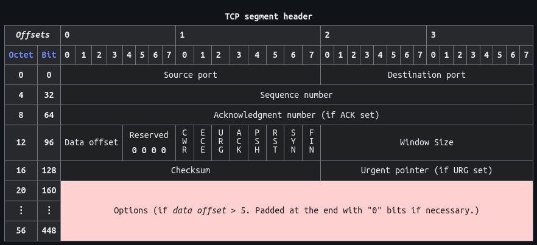
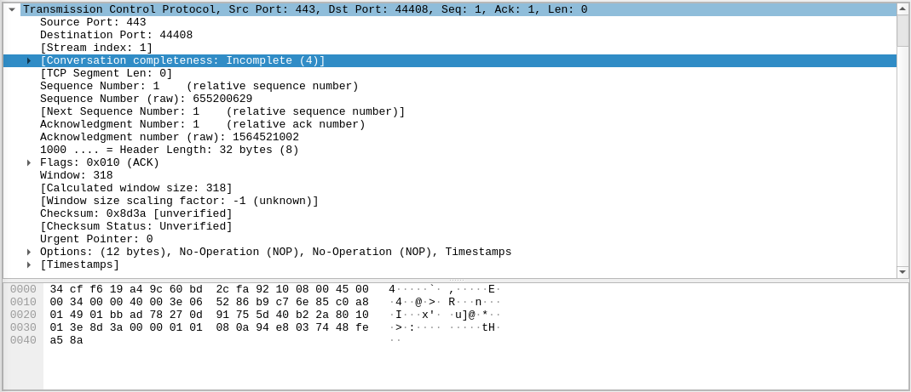

# Transmission Control Protocol (TCP) Packet Analysis
\- _By Sunil Sapkota_

The TCP is one of the core internet protocol. It provides a reliadble, ordered and error-checked transmission of byte-stream. It is connection-based protocol, which means that 2 ends of the network must establish a connection, through a agreed upon way (_three-way handshake_).

## TCP segment
A TCP segment consists of:

- A segment header with 10 mandatory fields.
- An optional extension field (often displayed with a pink background in tables).
- A data section that carries payload data for the application.

Notably, the segment header does not specify the data section’s length directly; it can be calculated by subtracting the combined length of the segment header and IP header from the total IP datagram length specified in the IP header.

## TCP Header Analysis
Before trying to breakdown the captured packet, it is important to understand all the fields in the TCP header and what they mean. Checkout this document on [wikipedia](https://en.wikipedia.org/wiki/Transmission_Control_Protocol).

1. **Source Port** (16 bits):
   - Identifies the sending port.
2. **Destination Port** (16 bits):
   - Identifies the receiving port.
3. **Sequence Number** (32 bits):
   - Dual role:
     - If the **SYN** flag is set (1), this is the initial sequence number.
     - If the **SYN** flag is unset (0), it's the accumulated sequence number of the first data byte for the current session.
4. **Acknowledgment Number** (32 bits):
   - If the **ACK** flag is set, this field indicates the next sequence number the sender of the ACK expects.
   - Acknowledges receipt of all prior bytes (if any).
5. **Data Offset** (4 bits):
   - Specifies the size of the TCP header in 32-bit words.
   - Minimum header size: 5 words (20 bytes); maximum: 15 words (60 bytes).
   - Also indicates the offset from the start of the TCP segment to the actual data.
6. **Reserved** (4 bits):
   - Set to zero for future use; senders ignore these bits.
7. **Flags** (8 bits):
   - Contains 8 1-bit control flags:
     - **CWR** (1 bit): Congestion window reduced (CWR) flag is set by the sending host to indicate that it received a TCP segment with the ECE flag set and had responded in congestion control mechanism.
     - **ECE** (1 bit): ECN-Echo has a dual role, depending on the value of the SYN flag. It indicates:
       - If the SYN flag is set (1), the TCP peer is ECN capable.
       - If the SYN flag is unset (0), a packet with the Congestion Experienced flag set (ECN=11) in its IP header was received during normal transmission. This serves as an indication of network congestion (or impending congestion) to the TCP sender.
     - **URG** (1 bit): Indicates that the Urgent pointer field is significant
     - **ACK** (1 bit): Indicates that the Acknowledgment field is significant. All packets after the initial SYN packet sent by the client should have this flag set.
     - **PSH** (1 bit): Push function. Asks to push the buffered data to the receiving application.
     - **RST** (1 bit): Reset the connection
     - **SYN** (1 bit): Synchronize sequence numbers. Only the first packet sent from each end should have this flag set. Some other flags and fields change meaning based on this flag, and some are only valid when it is set, and others when it is clear.
     - **FIN** (1 bit): Last packet from sender
8. **Options** (variable length):
   - The length of this field is determined by the data offset field. 
   - Options have up to three fields:
     - Option-**Kind** (1 byte) : It indicates the type of option and is the only field that is not optional. Depending on Option-Kind value, the next two fields may be set.
     - **Option-Length** (1 byte) : It indicates the total length of the option.
     - **Option-Data** (variable length) : It contains data associated with the option, if applicable.

### Captured Packet Analysis
Using wireshark, a TCP packet was captured for analysis.

1. **Source Port** : 0x01bb (443)
2. **Destination Port** : 0xad78 (44408)
3. **Sequence Number** : 0x270d9175 (655200629)
4. **Acknowledgement Number** : 0x5d40b22a (1564521002)
5. **Data Offset** : 0x8 (8)
6. **Reserved Bits** : 0x0 (0)
7. **Flags** : 0x10 (0b 0001 0000)
   - ACK flag is set
   - This means that the acknowledgement field is significant. All the following client-sent packets(except initial SYN packet) must have this field set.
8. **Window size** : 0x013e (318)
9. **Checksum** : 0x8d3a
10. **Urgent Pointer** : 0x0000 (0)
   - URG flag is not set, so this field is irrelevant
11. **Options** : 0x 01 01 08 0a 94 e8 03 74 48 fe a5 8a
   - 0x01 : No Operation (NOP)
   - 0x01 : No Operation (NOP)
   - 0x08 : Time stamp Option (8)
   - 0x0a : Associated Data Length (10)
   - 0x 94 e8 03 74 : Timestamp value : 2498233204
   - 0x 48 fe a5 8a : Timestamp echo reply : 1224648074
