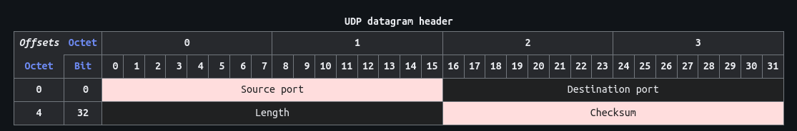
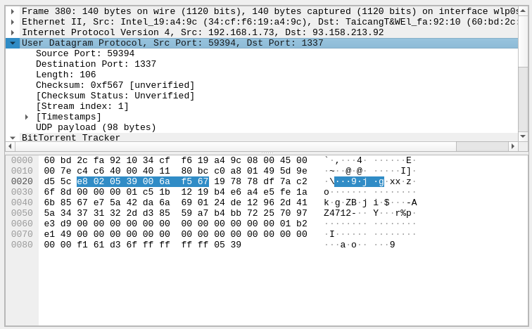

# User Datagram Protocol (UDP) Packet Analysis
\- _By Sunil Sapkota_

The UDP is a core internet protocol used for sending messages to hosts on an IP network. Unlike TCP, it doesnot need to establish a prior communication channel.

## UDP Datagram Structure
A UDP datagram consists of a datagram header followed by a data section (the payload data for the application). The UDP datagram header consists of 4 fields, each of which is 2 bytes (16 bits).

### UDP Header Structure

_source:_[_wikipedia_](https://en.wikipedia.org/wiki/User_Datagram_Protocol)

1. **Source Port** (16 bits):
   - Identifies the sender's port.
2. **Destination Port** (16 bits):
   - Identifies the receiver's port.
3. **Length** (16 bits):
   - Identifies the length of UDP header along with data.
4. **Checksum** (16 bits):
   - Used for error-checking of the header and data in most of the cases.

### Captured Packet Analysis
Following packet was captured in Wireshark for analysis.

Here is the breakdown of the header packet:
1. **Source Port** : 0xe802 (59394)
2. **Destination Port** : 0x0539 (1337)
3. **Length** : 0x006a (106)
4. **Checksum** : 0xf567 (62823)

The data segment actually consisted of an Announce Request for BitTorrent Tracker. UDP is a popular choice for communication with tracker because of many reasons, few of which are that, UDP doesnot require any overheads, packet sizes are very less, etc.
